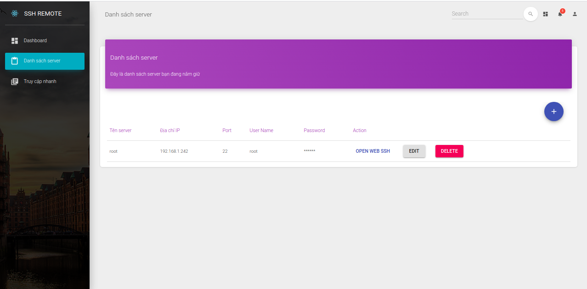

## Front-end remote server project
This is apart of remote server project. It's reposibility is display GUI to end user.

## Quick start
```text
$ npm start
```
## File Structure
```
── src
    |-- components
    |   |-- Card
    |   |-- CustomButtons
    |   |-- CustomInput
    |   |-- CustomTabs
    |   |-- FixedPlugin
    |   |-- Footer
    |   |-- Grid
    |   |-- Navbars
    |   |-- Sidebar
    |   |-- Snackbar
    |   |-- Table
    |   |-- Tasks
    |   `-- Typography
    |-- index.js
    |-- layouts
    |   |-- Admin.js
    |   `-- RTL.js
    |-- logo.svg
    |-- routes.js
    |-- variables
    |   |-- charts.js
    |   |-- general.js
    |   `-- urls.js
    `-- views
        |-- Dashboard
        |-- Icons
        |-- Maps
        |-- Notifications
        |-- RTLPage
        |-- ServerPage
        |-- TableList
        |-- Typography
        |-- UpgradeToPro
        `-- UserProfile
```
## Demo




## Technical Support or Questions

If you have questions or need help integrating the product please "thanh29695@gmail.com" instead of opening an issue.

